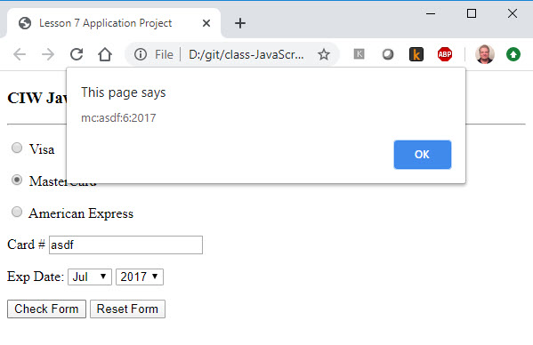

# Exercise 3

Your JavaScript is a program that runs right in the browser. It uses the HTML page as input and output. JavaScript can read from the input elements and change/create the elements on the page. In this exercise, we'll use simple pop-up "alert" messages for output.

JavaScript is highly asynchronous. There is no "program running all the time". Instead, you attach callback functions to various elements on the page (usually input elements like `<button>`). When the user triggers the right event, the browser calls your functions. When your functions return, the browser continues watching for other events.

In this exercise, we are attaching an `onclick` handler to the button that says "Check Form". When the user clicks this button, the JavaScript command given in the `onclick` runs. This command simply calls the `validate` function we have in our script.

The goals in the exercise is for our `validate` function to check all the input information and make sure it follows the rules outlined in the exercise. If it does, we give a "Yes!" feedback. If it does not, we explain what's wrong.

# My thought process

The first thing I do is to add a "I am here" output alert to the function to prove that the button actually gets to my function! My first `validate` code looks like this:

```js
    function validate(form) {
        alert('I am here');
    }
```

Next I load the form in the browser and press the "Check Form" button. Sure enough, the code they gave us does call the validate function. Here is that line of code they gave us. Notice the `onclick` javascript.

```html
<input type="button" value="Check Form" onClick="validate(this.form);" />
```

# Getting the values from the form

My function needs all the values from the form. `Section 7 Referring to Form Elements` shows the syntax for reading values from elements on the page. In the `<form>`, these input elements have unique `name` attributes that we can use to get their values:

```js
    function validate(form) {
        
        // First, get all the values from the form  
        var cardType = form.ccard.value;
        var cardNumber = form.number.value;
        var cardMonth = form.expMo.value;
        var cardYear = form.expYr.value;
        
        alert(cardType+':'+cardNumber+':'+cardMonth+':'+cardYear)
    }
```

I reload the form and put in some random data. Now when I click the "Check Form" the alert shows me the values that I read from the elements. You can see the printed data does match what I put in. I'll tinker around with this for a bit to see what the values are when things are given.



Notice that the code they gave us lists years from 2011 to 2018 -- which are all "expired" for me writing this in 2020. This is old code! I'll modify the HTML to use the current year plus the next seven. At the time of this writing, my change looks like this:

```html
<select name="expYr">
<option value=2020>2020
<option value=2021>2021
<option value=2022>2022
<option value=2023>2023
<option value=2024>2024
<option value=2025>2025
<option value=2026>2026
<option value=2027>2027
</select>
```

# Getting the current date

We need to check the expiration date against the current date. Have a look at the course materials in `Section 6 The Date Object`. The materials show how to get the current date and how to use `getMonth` and `getFullYear` to get the pieces we need.

```js
    function validate(form) {
        
        // First, get all the values from the form  
        var cardType = form.ccard.value;
        var cardNumber = form.number.value;
        var cardMonth = form.expMo.value;
        var cardYear = form.expYr.value;
        
        alert(cardType+':'+cardNumber+':'+cardMonth+':'+cardYear)
        
        // We'll compare the date to "now"
        var now = new Date();
        var nowMonth = now.getMonth();
        var nowYear = now.getFullYear();
        
        alert(nowMonth+":"+nowYear);
    }
```

I reload the form again and click "Check Form". Sure enough, I get two alerts: the first with my selected data and a second with the selected month/year. That's all the information I need from the form.

# Validating the card rules

The exercise lists the rules for each card. The first thing I need to do is make an `if` statement to handle the different possible values. I'll just put alerts in those for now -- just to make sure my logic is working.

You might want to review the material `Section 4 The if...else Statement`. It shows how to do an if/else-if block like this:

```js
function validate(form) {
        
        // First, get all the values from the form  
        var cardType = form.ccard.value;
        var cardNumber = form.number.value;
        var cardMonth = form.expMo.value;
        var cardYear = form.expYr.value;
        
        //alert(cardType+':'+cardNumber+':'+cardMonth+':'+cardYear)
        
        // We'll compare the date to "now"
        var now = new Date();
        var nowMonth = now.getMonth();
        var nowYear = now.getFullYear();
        
        //alert(nowMonth+":"+nowYear);
        
        if(cardType=='visa') {
            alert('This is a visa');
        } else if(cardType=='mc') {
            alert('This is a mastercard');
        } else if(cardType=='amex') {
            alert('This is an amex');
        } else {
            alert('You did not select a card');
        }
    }
```

Notice I commented out the debugging "alerts". I didn't delete them. I might need those again, and there is no harm leaving them there.

I reload the form and try all possibilities -- every card and no card. Seems to work fine!

Now for the individual rules. First the "VISA". The instruction say "must be 16 digits" and "first digit must be a 4". That's an `if` statement with two parts ANDed together. See `Section 4 The if...else Statement (Multiple conditions in the same expression)`.

Have a look at `Section 6 Evaluating Strings` for examples of `charAt` and `length`.

This is what I did:

```js
    if (cardType=='visa') {
        // Visa card numbers always begin with the numeral 4 and use 16 digits.      
        if(cardNumber.charAt(0)!=4 || cardNumber.length!=16) {
            alert('Invalid Visa card. Please try again.');
            return;
        }
    }
```

The `return` statement ends the validate function and returns to the caller. If you are fuzzy on that, look at `Section 3 Calling a Function`.

I reload the form and try different combinations of values for the visa card: too short, too long, no leading 4, blank, etc. If anything is wrong, I get an error message. If everything is OK, I get nothing. I need to add an alert at the end if everything is OK.

And I'll fill out the rules for the other cards. Here is the validate so far:

```js
function validate(form) {
        
        // First, get all the values from the form  
        var cardType = form.ccard.value;
        var cardNumber = form.number.value;
        var cardMonth = form.expMo.value;
        var cardYear = form.expYr.value;
        
        //alert(cardType+':'+cardNumber+':'+cardMonth+':'+cardYear)
        
        // We'll compare the date to "now"
        var now = new Date();
        var nowMonth = now.getMonth();
        var nowYear = now.getFullYear();
        
        //alert(nowMonth+":"+nowYear);
        
        if (cardType=='visa') {
            // Visa card numbers always begin with the numeral 4 and use 16 digits.      
            if(cardNumber.charAt(0)!=4 || cardNumber.length!=16) {
                alert('Invalid Visa card. Please try again.');
                return;
            }
        } else if(cardType=='mc') {
            // MasterCard numbers always begin with the numeral 5 and use 16 digits.
            if(cardNumber.charAt(0)!=5 || cardNumber.length!=16) {
                alert('Invalid MasterCard card. Please try again.');
                return;
            }
        } else if(cardType=='amex') {
            // American Express card numbers always begin with the numeral 3 and use 15
            if(cardNumber.charAt(0)!=3 || cardNumber.length!=15) {
                alert('Invalid AmericanExpress card. Please try again.');
                return;
            }       
        } else {
            alert('You did not select a card');
        }      
        
        alert('Everything is OK');
        
    }
```

# Check the date

Before we say "Everything is OK" we need to check the date. The value of the month only matters if we are in the same year. January of 2020 is before June of 2020 but when comparing the years 2021 and 2020, the month is unimportant).

Note that there aren't any "previous year" values in the list of years. We don't even let the user select an invalid year. But it doesn't hurt to check, right?

```js
    if (cardYear<nowYear) {
        // If the years are different, the month doesn't matter.
        // Of course, if previous years are not in the list then this
        // check can be left out.
        alert('Card date has expired. Please use a different card.');
        return;
    }   
    if (cardYear==nowYear && cardMonth<nowMonth) {
        // If the years are the same, we have to check the month.
        alert('Card date has expired. Please use a different card.');
        return;
    }
    
    alert('Everything is OK');
````

Again, if we bump into an error we just print the message and `return` from the function.

# Some friendly feedback

That's all we have to do, but I'm going to add some friendlier feedback at the top of the form. For the special case of "no numbered entered" we can give better feedback than "Invalid card". How about:

```js
    if (cardNumber=='') {
        alert('Please enter a card number.');
        return;
    }
```

# My final solution

And here is my entire validate function for reference. The next step is to test, test, test! Try all kinds of crazy things and edge conditions.

```js
    function validate(form) {
        
        // First, get all the values from the form  
        var cardType = form.ccard.value;
        var cardNumber = form.number.value;
        var cardMonth = form.expMo.value;
        var cardYear = form.expYr.value;
        
        //alert(cardType+':'+cardNumber+':'+cardMonth+':'+cardYear)
        
        // We'll compare the date to "now"
        var now = new Date();
        var nowMonth = now.getMonth();
        var nowYear = now.getFullYear();
        
        //alert(nowMonth+":"+nowYear);
        
        if (cardNumber=='') {
            alert('Please enter a card number.');
            return;
        }
        
        if (cardType=='visa') {
            // Visa card numbers always begin with the numeral 4 and use 16 digits.      
            if(cardNumber.charAt(0)!=4 || cardNumber.length!=16) {
                alert('Invalid Visa card. Please try again.');
                return;
            }
        } else if(cardType=='mc') {
            // MasterCard numbers always begin with the numeral 5 and use 16 digits.
            if(cardNumber.charAt(0)!=5 || cardNumber.length!=16) {
                alert('Invalid MasterCard card. Please try again.');
                return;
            }
        } else if(cardType=='amex') {
            // American Express card numbers always begin with the numeral 3 and use 15
            if(cardNumber.charAt(0)!=3 || cardNumber.length!=15) {
                alert('Invalid AmericanExpress card. Please try again.');
                return;
            }       
        } else {
            alert('You did not select a card');
            return
        }
        
        // Check the date
    
        if (cardYear<nowYear) {
            // If the years are different, the month doesn't matter.
            // Of course, if previous years are not in the list then this
            // check can be left out.
            alert('Card date has expired. Please use a different card.');
            return;
        }   
        if (cardYear==nowYear && cardMonth<nowMonth) {
            // If the years are the same, we have to check the month.
            alert('Card date has expired. Please use a different card.');
            return;
        }
        
        alert('Everything is OK');
        
    }
```


